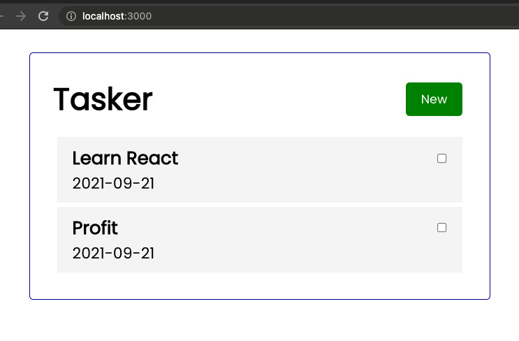
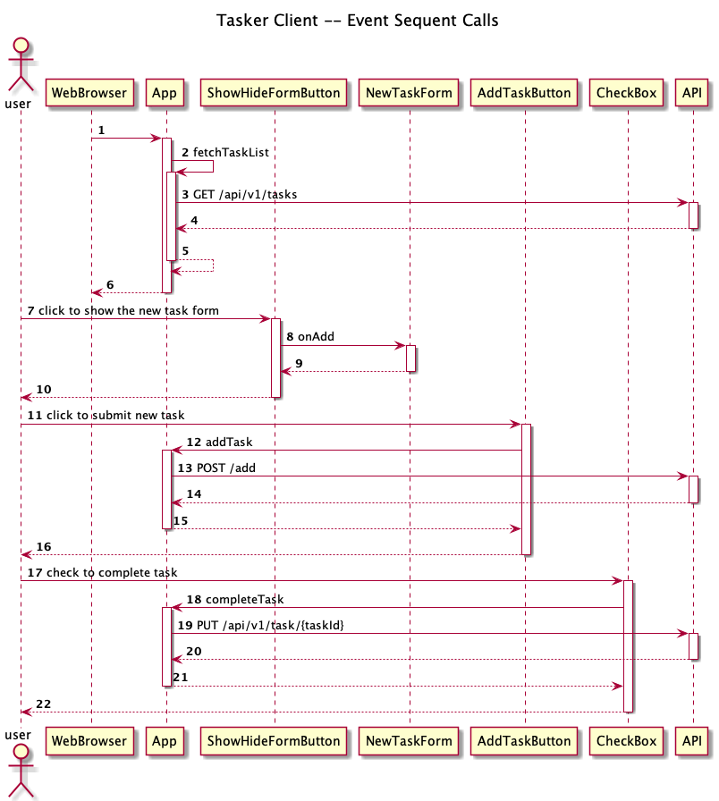

# Task Manager UI


## Clone
To clone, type this in the terminal
```shell
git clone https://github.com/muntasirrahman/taskman-client.git
```

### Launch Application

The App requires backend application, see  [taskman-api](https://github.com/muntasirrahman/taskman-api)


```shell
npm start
```
Runs the app in the development mode.\
Open [http://localhost:3000](http://localhost:3000) to view it in the browser.

 

### How It Works



To update this sequence diagram,
* install PlantUML plugin
* Edit the events.puml file in the docs folder

### Test

To test the application

```shell
npm test
```
Launches the test runner in the interactive watch mode.\


## Deployment
### Production Build

Edit the `.env.production` file
```
REACT_APP_API_HOST=http://150.230.44.18
```

Also edit the nginx configuration file `nginx/nginx.conf` to ensure the Backend API URL
```shell
proxy_pass  http://10.0.0.205:8000;
```

Then type:
```shell
npm run build
```

Builds the app for production to the `build` folder.\
It bundles the app in production mode and optimizes the build for the best performance.

The build is minified and the filenames include the hashes.\
The app is ready to be deployed!


### Docker Image

Build the Docker image, by typing this:
```shell
docker build -t taskman-client:amd64 -f Dockerfile.prod .
```

Then push it to the Docker hub
```shell
docker push muntasir/taskman-client:amd64
```

Check the presence of the newly uploaded docker image, by open this URL
[https://hub.docker.com/repository/docker/muntasir/taskman-client](https://hub.docker.com/repository/docker/muntasir/taskman-client)

At the deployment server
```shell
docker pull muntasir/taskman-client:amd64
```

To run it
```shell
docker run -p 80:80 muntasir/taskman-client:amd64
```
